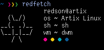

<h1 align="center"><code>Redfetch</code></h1>
<p align="center">A fast fetch written in C, with the ppfetch Ascii Art.</p>
<p align="center">
 
<!-- -->

</p>

<p align="center">
<a href="screenshot.png">
  
</a>
</p>

## Dependencies
 - `wmctrl`
 - `a C compiler` (such as clang or gcc)
 - `make`
## Installation
Build:
```
git clone https://github.com/RedsonBr140/redfetch.git
cd redfetch
make
```
Install:
```
sudo make install
```
## TODO
 - [ ] Add a reset at the end of the colors blocks.
## Thanks to
 - [Pedro Portales](https://github.com/pedroportales) - by creating [ppfetch](https://github.com/pedroportales/ppfetch) and his beautiful bat ascii art.
